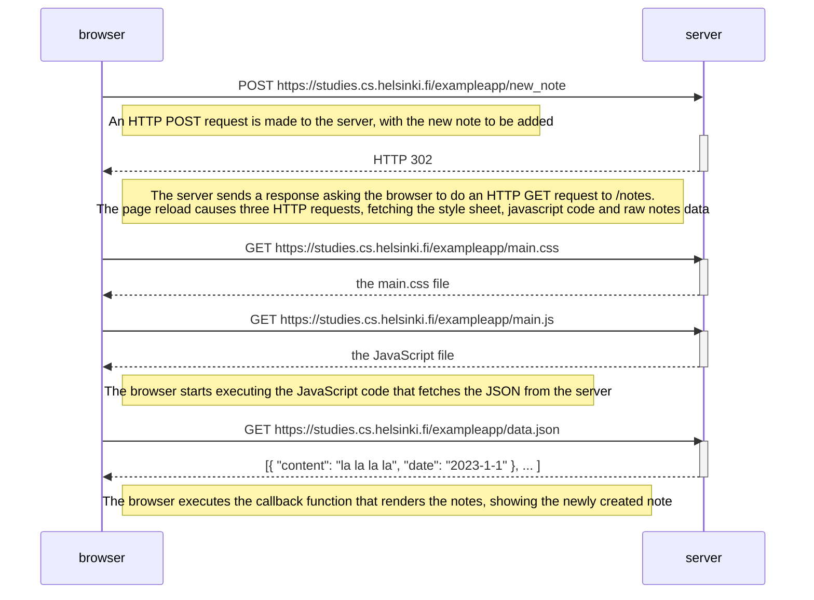
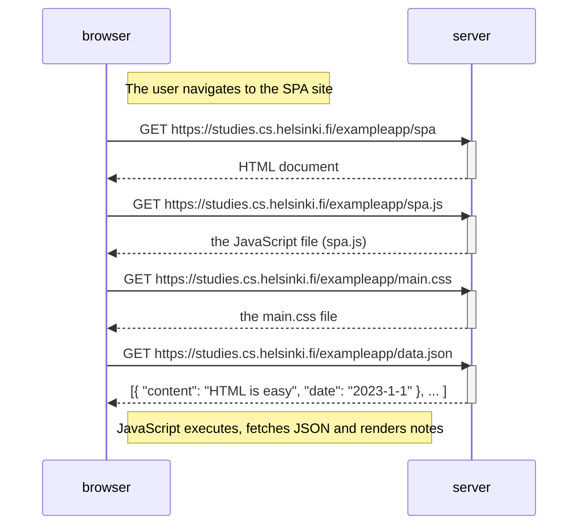
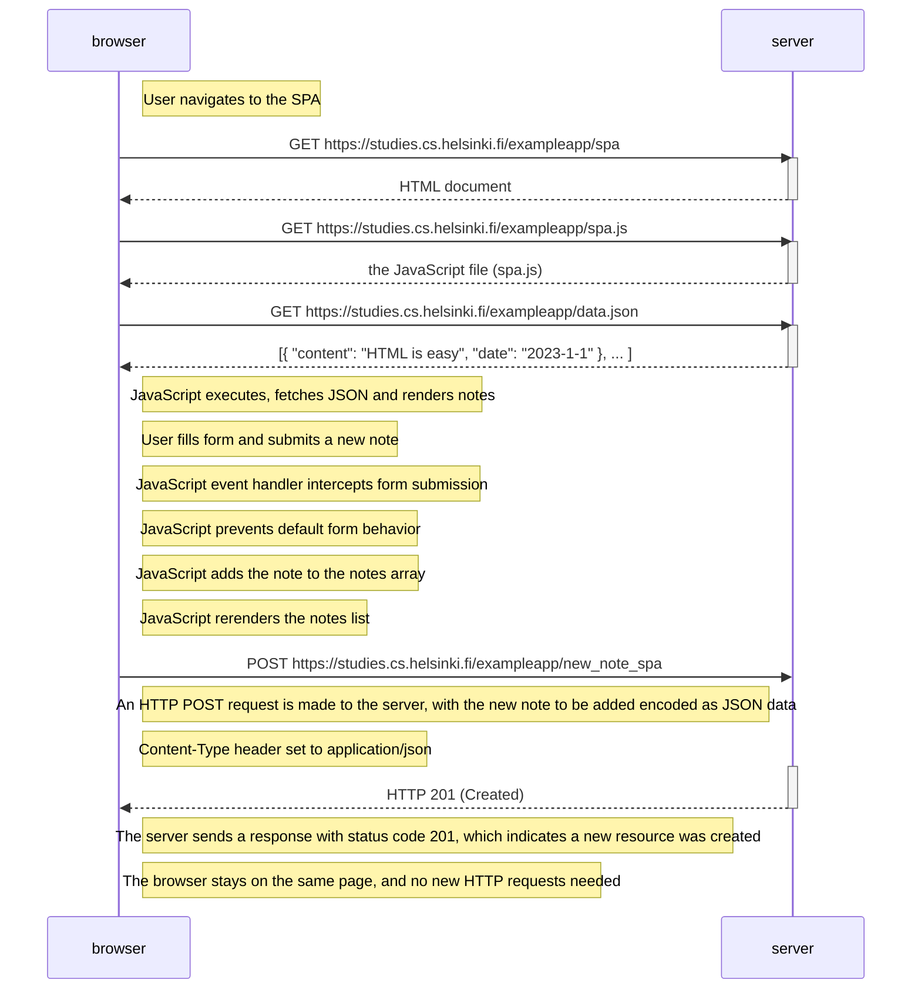

# Note-Taking App Documentation

## Save Functionality

When a user writes a note into the text field and then clicks the "Save" button, the following sequence of events occurs:

## Single page app 
##### When a user accesses the single page application, the following events occur: 

## Creating a new note in the Single page app 
